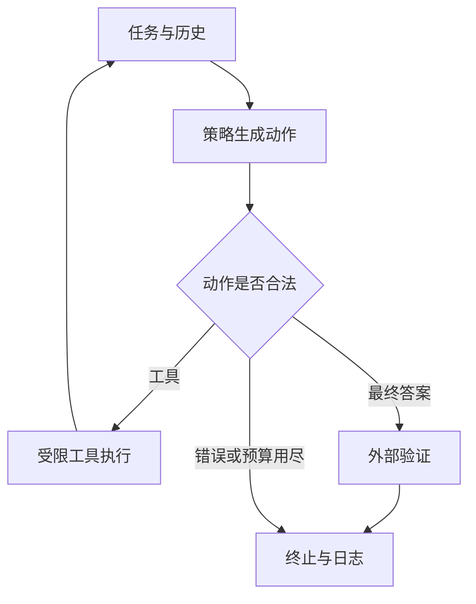

# 12 · Agent 的系统基础：观察、行动、验证与终止

让模型能够调用工具很容易；让一次任务可靠地结束，需要系统设计。
以“找到报表、提取收入并写入表格”为例，模型必须知道报表来源、工具实际返回了什么、数值对应哪个口径以及写入是否成功。
如果执行器只接收一段“已完成”文字，它无法判断任何这些条件。
本章从最小工具循环出发，建立一套可审计的 Agent 系统概念。

学习目标是区分语言模型、策略、执行器、环境、记忆和验证器，并把各自责任写成接口。
不需要先假设模型具备人类式“自主性”；先把一次行动的输入与结果说明白。

## 12.1 模型不是整个 Agent

语言模型负责生成动作提议；执行器负责解释提议、检查约束并调用工具。
环境返回观察；记忆决定哪些历史进入下轮上下文；验证器判定完成；预算控制器决定何时停止。
同一个模型换用不同工具说明、观察格式和检索器，任务成功率可能变化。
所以比较 Agent 时必须同时记录模型版本与外围系统版本。

| 部件 | 输入 | 输出 | 不能替它承担的责任 |
| --- | --- | --- | --- |
| 策略 | 任务和历史 | 工具调用或最终答案 | 不证明工具已执行 |
| 执行器 | 动作提议 | 调用结果或错误 | 不创造外部事实 |
| 环境 | 合法动作 | 新状态和观测 | 不保证模型理解观测 |
| 记忆 | 历史和查询 | 被选中的证据 | 不保证证据仍然有效 |
| 验证器 | 结果与环境 | 通过、失败或未判定 | 不替代完整安全审查 |

一个工具循环的关系可以画成以下结构：



图中的“合法”至少包含语法、参数类型、工具存在性和权限。
本仓库仅提供其中的教学接口与有界行为；外部工具仍由调用者负责隔离和授权。

## 12.2 从文本到结构化动作

“去查一下价格”对人类可读，对执行器却缺少对象和参数。
结构化调用把动作压成可检查的形状，例如 `{"type":"tool","tool":"lookup","arguments":{"sku":"A17"}}`。
最终答案使用 `{"type":"final","answer":...}`，让终止意图与普通文字分开。
受约束解码能降低格式错误，但格式正确不能保证对象正确，更不能保证该动作被允许。

参数校验应该发生在执行之前：数量范围、路径范围、URL 域名、枚举值和必填字段都适合程序检查。
遇到错误要记录原提议、错误类别和反馈，而不是悄悄修补成另一个动作后假装模型本来就正确。
若执行器允许修正格式，应记录修正策略并在实验组间保持一致。

工具输出也是接口。
例如文件搜索返回路径、匹配片段和版本；计算返回值和单位；网页操作返回是否成功及新的页面观察。
把错误全部转成空字符串会让策略无法区别“没有结果”与“查询失败”。

## 12.3 计划是可修订的状态

[ReAct 原论文](https://arxiv.org/abs/2210.03629) 研究推理文本和环境动作交替生成。
这一设计的价值在于新观察可以改变后续决定；它不要求模型先写一份永远正确的完整计划。
计划可以只列出当前子目标与完成证据，工具错误出现时更新计划。

设某个子目标是“确认目标函数的调用位置”。
可以记录：待检查目录、已经搜索的关键词、证据文件与下一动作。
这样比把每轮完整日志不断重复到上下文里更节省预算，也更容易发现循环。
但压缩计划可能漏掉异常，因此应保留可回查的原始日志。

分层策略进一步把“解决哪个子目标”与“执行哪个细节动作”分开。
其收益依赖子目标定义与终止判断；错误的上层计划会让多个下层动作一起偏离目标。
如果采用多 Agent 分工，还要记录谁能写哪些状态、如何合并结果以及如何处理相互矛盾的证据。
多个模型投票并不自动等于独立验证，它们可能共享数据与错误模式。

## 12.4 三个工程场景

**财务报表提取。** 检索模型找到报表后，抽取器需要保留年份、货币和合并口径。
计算工具进行数值运算，最终答案引用实际来源。
验证器检查字段是否齐全及计算是否与输入一致；没有报表证据时应保持未判定，不能生成一段合理数字。

**仓库修改。** 工具允许读写指定工作树、运行受限测试。
策略应先理解 issue 和失败证据，补丁生成后再运行测试。
环境中的测试输出提供反馈；系统保留修改 diff 和命令退出码，供最终评测或人类审查。
不能把模型自己写的新测试全部通过等同于真实 issue 已解决。

**网页表单。** 截图与 DOM 提供当前观察，点击产生新状态。
页面布局变化时，使用对象身份、字段标签和最新观察比沿用旧坐标更可靠。
操作可能出现重复提交，执行器应对有副作用的动作使用环境提供的事务或幂等能力。
评估时在基准专用环境里操作，保持每个任务的初始状态可重置。

## 12.5 可运行的接口练习

下面的固定策略用于观察执行器的行为；它没有语言模型，也不是能力基准。
在仓库根目录安装本项目后，可运行：

```python
from fm_tutorial.agent import run_agent

def policy(history):
    if not history:
        return {"type": "tool", "tool": "multiply",
                "arguments": {"a": 6, "b": 7}}
    return {"type": "final", "answer": 42}

def multiply(a, b):
    return a * b

def verifier(answer, history):
    return answer == 42

result = run_agent(
    policy,
    {"multiply": multiply},
    verifier,
    max_steps=3,
    time_budget_seconds=5.0,
    self_judge=lambda answer, history: {"confidence": 0.9},
)
print(result["status"], result["answer"], result["steps"])
```

这里故意让策略直接给出固定答案，避免读者误以为它从日志中学会了计算。
练习的是动作类型、工具注册和最终验证的接口；真实策略应消费观察并根据工具返回值决定答案。
`self_judge` 的置信度不会改变成功状态。
将答案改成 41 时，必须由外部 `verifier` 判为失败，即使自评仍写 0.9。

接口实现见 [agent.py](../src/fm_tutorial/agent.py)，行为检查见 [tests 目录](../tests/)。
执行器返回 `status`、`answer`、`trace` 与 `steps`，可通过 `log_path` 输出 JSONL 轨迹。
验证器必须返回严格 `bool`；`log_path` 会覆盖同名文件，真实运行应为每条轨迹使用独立路径。
日志对极深或不支持的观察进行有界摘要，接入真实环境时应另存可回查的完整观察。
状态涵盖成功、验证失败、动作预算、时间预算和策略异常等终止情况。
阅读具体实现时核对日志字段，避免把上面最小示例当作所有真实环境的适配器。

## 12.6 预算和终止是算法的一部分

如果每轮上下文长度是 $L_t$，生成长度是 $G_t$，总推理开销依赖 $\sum_t f(L_t,G_t)$。
仅比较动作数可能忽略大量检索文本和模型思考 token；仅比较 token 又可能忽略昂贵的外部工具。
报告应分别记录 token、调用次数、墙钟时间与外部服务成本。

当模型重复相同失败动作时，系统可以给出错误信息或终止，但这种干预会影响实验结果。
把重试次数、最大动作数和停止规则作为评测配置固定下来。
工具操作成功与任务完成不同；最终答案动作也应进入步数预算。

本仓库时间预算在回调前后合作式检查，不能杀死阻塞回调。
真实工具应自行设网络超时，或在可被终止的隔离进程中执行。
预算耗尽要保留最后观察、已发生副作用和停止原因，方便恢复而不是从头重复操作。

## 12.7 用公开任务检查完整系统

[AgentBench](https://github.com/THUDM/AgentBench/blob/main/README.md) 提供多种交互任务。
阅读其 [任务配置目录](https://github.com/THUDM/AgentBench/tree/main/configs/tasks)，理解不同环境为何需要不同结果判定。
用 [BrowserGym demo](https://github.com/ServiceNow/BrowserGym/blob/main/demo_agent/README.md) 学习浏览器观察与动作接口，再按 WebArena 配置启动相应服务。
命令行任务可查 [Terminal-Bench 当前仓库](https://github.com/harbor-framework/terminal-bench/blob/main/README.md)，并固定具体发布版本。

这些系统不一定能直接接入本仓库的两个动作类型；需要编写环境适配器。
适配器应把官方观察转为策略输入，把合法动作映射到官方动作空间，把官方终止和奖励原样记录。
禁止自己简化任务后仍使用原基准名称报告分数。

## 12.8 实践与自查

1. 在接口练习中加入一次未知工具调用，核对是否记录错误、消耗预算并最终终止。
2. 写出一个只读搜索工具的参数约束，说明哪些约束应由模型提示承担，哪些应由程序强制执行。
3. 为报表场景设计三个不同的验证失败原因：没有来源、口径不一致、计算不一致。
4. 在一条真实公开基准轨迹中标出观察、动作、环境错误和最终验收，解释是否能仅用最终答案重放任务。

下一章：[13 · 记忆与长期上下文](13-memory.md)；真实任务交付见 [作业 05](../assignments/05-agent.md)。
