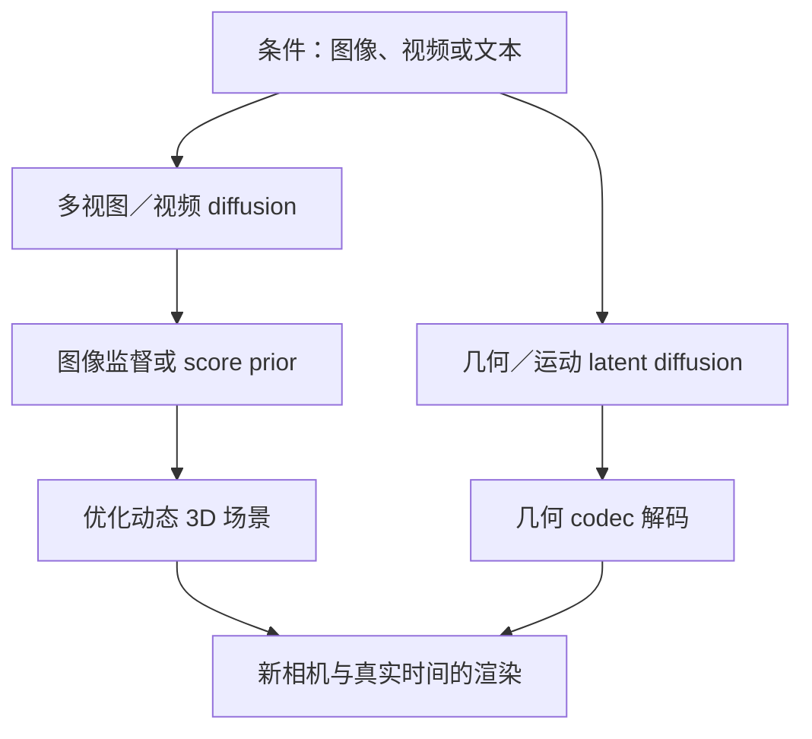

# 17b　跨模态 diffusion：图像、混合表格、视频与动态 3D

> 前置：[17 DDPM 与 score-based 模型](17-diffusion.md)、[17a 连续与离散文本](17a-diffusion-text.md)；代码：[continuous.py](../src/fm_tutorial/diffusion/continuous.py)、[discrete.py](../src/fm_tutorial/diffusion/discrete.py)；运行入口：[diffusion_shapes.py](../scripts/diffusion_shapes.py)；实践：[作业六](../assignments/06-diffusion.md)；逐项来源：[diffusion 来源表](../references/diffusion.md)。

本章要回答的不是“哪些领域也用了 diffusion”，而是：同一个加噪公式移到新数据上时，什么可以复用，什么必须重做？我们沿着四个场景走：生成一张条件图像、合成一行混合类型的表格、生成一个连续视频片段，以及从视频构建可以换视角观察的动态 3D 对象。

阅读时始终分清四层：**数据表示、噪声过程、去噪网络、解码或渲染**。高斯加噪能作用于任意浮点张量，但张量接口通用不等于模型理解了空间、列语义、运动或几何。这里的小代码证明算法和 shape；本仓库没有训练图像/视频 codec，也没有执行大型预训练权重或完成论文 benchmark。

## 17b.1 先固定共同接口，再找模态的变化

对任意连续表示 $z_0\in\mathbb R^{B\times\cdots}$，DDPM 的边缘分布仍是：

$$
z_t=\sqrt{\bar\alpha_t}z_0+\sqrt{1-\bar\alpha_t}\epsilon,
\qquad \epsilon\sim\mathcal N(0,I),
\qquad
\mathcal L_\epsilon=\mathbb E\|\epsilon-\epsilon_\theta(z_t,t,c)\|^2.
$$

系数只依赖每个样本的噪声时间，所以 `[B]` 要广播成 `[B,1,...,1]`。`GaussianDiffusion.q_sample` 不需要知道后面是图像、表格还是点轨迹；`predict_x0` 也只是使用

$$
\hat z_0=\frac{z_t-\sqrt{1-\bar\alpha_t}\,\hat\epsilon}{\sqrt{\bar\alpha_t}}.
$$

`sample` 每一步调用网络，再根据所选 DDPM/DDIM 更新式移动到较低噪声。去噪器必须返回与输入相同的 epsilon shape；预测方差、$v$ 或 flow velocity 的网络需要对应的损失与采样器，不能只改输出名称。VP 连续时间接口 `VPSDE` 也能作用于同样的浮点表示；score 与 epsilon 的换算依赖其边缘噪声标准差，见 [17](17-diffusion.md)。

本项目 Gaussian 数组时间 `0..T-1` 对应论文的噪声步 `1..T`，数组 `t=0` 已有第一步噪声，干净端另用 $\bar\alpha=1$ 处理。离散 categorical 使用 `1..T`，并保留干净 `Q_bar[0]=I`；混合表格会同时碰到这两种约定。

在复用公式之前，先明确下面五个问题。

| 决定 | 图像 | 表格 | 视频 | 动态 3D，即本章的 4D |
| --- | --- | --- | --- | --- |
| 一个样本是什么 | 一张图像 | 一行记录 | 一段视频 | 随真实时间变化的 3D 场景 |
| 扰动什么 | 像素或 codec latent | 数值与类别分别处理 | 像素或时空 latent | 对齐几何/运动 latent，或用于重建的图像 latent |
| 网络要交换什么信息 | 空间位置、条件文本 | 同一行的不同列 | 空间与不同帧 | 点/面对应、真实时间、相机与视角 |
| 怎样得到可用输出 | 直接像素或 codec decode | 逆预处理、类别解码 | 视频 decode | 解码几何，或拟合场景后渲染 |
| 必须额外检查什么 | 内容与条件对应、细节 | 联合相关、逻辑约束 | 身份与运动一致性 | 多视角几何、时间连续性与可渲染性 |

噪声通常独立采样，去噪预测却不应逐元素独立。若网络只看一个像素、一个列或一个帧，学习到的主要是相应边缘分布，无法充分建模联合结构。

## 17b.2 场景一：一张图像怎样经过 encode、加噪、去噪与 decode

### 像素空间与 latent 空间的区别

像素 DDPM 直接用 `x0: [B,3,H,W]`。像素缩放到怎样的范围、颜色通道顺序、裁剪与 resize 都属于训练分布的一部分；训练用 `[-1,1]`，采样后却按 `[0,1]` 解释，会改变颜色和对比度。

Latent diffusion 先引入编码器 $E$ 与解码器 $D$：

$$
x\xrightarrow{E}z_0=aE(x),\qquad
z_t=\sqrt{\bar\alpha_t}z_0+\sqrt{1-\bar\alpha_t}\epsilon,
\qquad
\hat x=D(\hat z_0/a).
$$

这里 $a$ 是该 codec/模型规定的 latent 尺度；有些编码器给出分布，需要按既定规则取 posterior sample 或 mean。它们不是随意的工程细节：如果训练与推理 latent 方差不一致，同一 $\beta_t$ 对应的信噪比就变了。

例如，仅为解释 shape，空间压缩因子取 $f=8$、latent 通道取 4：

| 阶段 | 张量 | 执行的工作 |
| --- | --- | --- |
| 原图 | `[B,3,256,256]` | 读取并按训练规则归一化 |
| encode | `[B,4,32,32]` | codec 将像素变成连续表示 |
| 加噪 | `[B,4,32,32]` | 对 latent 采样 Gaussian，不改变 layout |
| 去噪 | `[B,4,32,32]` | 网络结合噪声时间和条件预测 epsilon |
| 反向采样完成 | `[B,4,32,32]` | 获得生成的干净 latent |
| decode | `[B,3,256,256]` | 按同一个 codec 的尺度约定恢复像素 |

这不是所有 LDM 的固定规格。通道数、压缩率、量化/KL 正则和尺度应从实际配置读取。图像的 codec 是另一个训练问题，典型目标包含重建、感知与分布正则，有时包含对抗损失；diffusion 的噪声预测损失不能替代 codec 重建训练。

先看 $D(E(x))$ 很有价值：文字细线已经在 codec 重建中消失时，仅优化 latent 噪声预测不能保证恢复该输入的那些细节。生成器还可能依据先验补出看似合理的细节，因此“看起来清晰”与“忠实重建输入”也要分开评价。

**LDM 解决的缺口。** [High-Resolution Image Synthesis with Latent Diffusion Models](https://arxiv.org/abs/2112.10752) 针对像素空间反复去噪的高成本，把生成建模放到预训练自编码器的较小表示中，并用 cross-attention 接入文本等条件。研究设计的核心不是简单缩小图片，而是在压缩成本与重建细节之间选 codec，再训练 latent prior。读论文实验时观察压缩率消融、图像生成与条件任务的区别；某个 FID 结果不能证明所有压缩率、文字渲染或输入重建都同样好。

源码从 [CompVis/latent-diffusion](https://github.com/CompVis/latent-diffusion) 开始，先读 [`ldm/models/diffusion/ddpm.py`](https://github.com/CompVis/latent-diffusion/blob/main/ldm/models/diffusion/ddpm.py) 中 first-stage encode/decode、条件包装与扩散训练的调用关系。codec 是 first stage，噪声预测网络是 diffusion stage；名字里都有“encoder”时也不能混成一个模型。

### U-Net：为什么既下采样，又把浅层特征接回来

假设去噪 latent 为 `[B,4,32,32]`。U-Net 下行路径将分辨率逐级降到 `16×16`、`8×8` 等，同时增加通道；小分辨率上的特征更容易汇总较大的空间范围。上行路径逐级恢复分辨率，并拼接对应下行特征：

$$
h^{\mathrm{up}}_\ell=
\mathrm{Block}_\ell\!\left(
\mathrm{Concat}_{\mathrm{channel}}!
\left[\mathrm{Upsample}(h^{\mathrm{up}}_{\ell+1}),
h^{\mathrm{down}}_\ell\right],e_t,c\right).
$$

拼接要求同一层的高宽匹配，通道可以不同。Skip connection 使高分辨率局部结构有短路径进入输出；它不是把干净图像偷偷传给网络，因为 skip 的源头仍是带噪输入。若训练时从 `x0` 提取 skip、测试时却只有 `xt`，就发生目标泄漏。

噪声时间先做 sinusoidal embedding，再经 MLP，在残差块内加到通道或生成归一化的 scale/shift。否则网络难以区分“现在只是少量纹理噪声”与“现在几乎没有可见内容”。条件文本又是另一组输入；它告诉网络要生成什么，并不代替噪声强度。

空间 self-attention 将 feature map `[B,C,h,w]` 转成 `[B,hw,C]`。每个位置可以直接读取其他位置，适合连接相距较远的主体部分。文本 cross-attention 则取图像特征作为 query、文本 `[B,L,d_c]` 作为 key/value，单头分数为 `[B,hw,L]`：

$$
\mathrm{CrossAttn}(H,C)=
\mathrm{softmax}\!\left(\frac{(HW_Q)(CW_K)^\top}{\sqrt{d_h}}\right)CW_V.
$$

没有文本时的图像 self-attention 是 `[B,hw,hw]`；两者交换的信息和复杂度不同。图像去噪不要求语言 next-token 的因果 mask，所有带噪图像位置可以互看。

### DiT：把 latent 切成 patch，但噪声过程仍可以相同

DiT 替换的是去噪网络主干。对 `[B,C_z,h,w]` 以 $p\times p$ patch 切分，得到

$$
N=\frac{hw}{p^2},\qquad
[B,C_z,h,w]\rightarrow[B,N,p^2C_z]\rightarrow[B,N,d].
$$

例如 `[B,4,32,32]`、$p=2$ 得到 256 个 token，每个 patch 原始维度为 16。加入二维位置编码后，Transformer 在这些 token 间交换信息；最终线性投影与 unpatchify 恢复 latent shape。减小 $p$ 增加 token 数和空间粒度，也增加 attention 的二次项，不能只按参数量比较成本。

时间和条件可以通过 adaptive LayerNorm 进入 block。用 $e=e_t+e_c$ 生成逐通道的 shift、scale 和 residual gate，一个注意力子层可写为：

$$
\tilde H=(1+\gamma(e))\odot\mathrm{LN}(H)+\delta(e),\qquad
H'=H+g(e)\odot\mathrm{Attention}(\tilde H).
$$

这些 `[B,d]` 调制量沿 token 轴广播。`adaLN-Zero` 的零初始化残差门使初始 block 接近恒等映射；它不是把所有主干参数初始化为零。训练时随机把类别/文本条件换成 null 条件，使同一个网络学条件与无条件预测；采样才有依据计算 [17](17-diffusion.md) 的 classifier-free guidance。仅在采样时加入 null embedding、从未训练该分支，不能等价实现 CFG。

**DiT 解决的缺口。** [Scalable Diffusion Models with Transformers](https://arxiv.org/abs/2212.09748) 在 latent diffusion 中研究 Transformer 主干如何随深度、宽度与 patch token 数扩展，原论文主要验证 class-conditional ImageNet。实验把质量与 forward GFLOPs 联系起来，不能缩成“Transformer 在所有模态必然优于 U-Net”。做自己的比较时应同时固定 codec、数据、训练预算、采样器与 CFG，并分别报告参数、计算和质量。

在 [facebookresearch/DiT](https://github.com/facebookresearch/DiT) 的 [`models.py`](https://github.com/facebookresearch/DiT/blob/main/models.py) 追踪 `PatchEmbed → timestep/label embedding → DiTBlock → FinalLayer → unpatchify`，检查 `LabelEmbedder` 的条件 dropout 与 `adaLN_modulation`。原实现可学习方差时输出通道为 $2C_z$；本章教学 Gaussian 接口只接受 $C_z$ 个 epsilon 通道，不能直接接上原网络的完整输出。

## 17b.3 场景二：一行表格同时有收入、年龄与职业类别

### 为什么不能把整行一律当作连续向量

设一行记录含三列数值和两列类别：

$$
u_0\in\mathbb R^3,\qquad
k_0^{(1)}\in\{0,1,2\},\qquad
k_0^{(2)}\in\{0,1,2,3\}.
$$

数值 0、1、2 可以有距离和顺序；职业 ID 0、1、2 通常没有这种距离。“职业 2 比职业 1 大一倍”没有意义。把 ID 转为 float 然后加 Gaussian，会把类别编码的任意编号强行变成几何结构。

一种混合过程是数值用 Gaussian，每个类别列用自己的转移矩阵：

$$
q(u_t,k_t\mid u_0,k_0)
=q_G(u_t\mid u_0)
\prod_{j=1}^{m_{cat}}q_j(k_t^{(j)}\mid k_0^{(j)}),
\quad
Q_t^{(j)}=(1-\beta_t)I+\beta_t\frac{\mathbf1\mathbf1^\top}{K_j}.
$$

独立扰动各列并不假设数据各列独立。一个统一去噪器读取整行，联合预测数值 epsilon 和各类别的 clean logits：

$$
h_\theta=\mathrm{MLP}\left([u_t;\mathrm{onehot}(k_t^{(1)});\ldots],e_t,c\right),\qquad
\hat\epsilon=W_{num}h_\theta,\quad
\ell^{(j)}=W_jh_\theta.
$$

收入预测能读取年龄与职业；职业预测也能读取带噪数值。若拆成互不交流的每列模型，即使每列直方图都正确，也可能生成完全错误的联合关系。

“每行独立采样”指生成器建模 $p(\mathrm{row})$，不同样本之间没有特殊的关系约束。它不表示一行内部的列独立。客户表和订单表的外键一致性、同一客户跨行的时间序列、群体总额等任务需要关系/序列结构；单行 TabDDPM 不能自然保证它们。

### 预处理也是模型的一部分，必须只在 train 上拟合

先划分真实 train/validation/test，再在 train 上计算数值变换和类别词表。均值方差、quantile transform、缺失值填补与低频类别合并都会学习统计信息，不能在全量数据上拟合。验证/测试中未见的类别需要明确 unknown 策略，而不是重新扩大输出头。

对普通标准化，训练得到 $\mu_j,\sigma_j$：

$$
u_j=(x_j-\mu_j)/\max(\sigma_j,\varepsilon),
\qquad \hat x_j=\hat u_j\max(\sigma_j,\varepsilon)+\mu_j.
$$

下列训练集标准化代码不需要新依赖；实际数据的 missing mask、常数列与整数列应另定义处理规则。

```python
# train_numeric: [N_train,D]；其余 split 不参与 fit。
mean = train_numeric.mean(dim=0, keepdim=True)
scale = train_numeric.std(dim=0, unbiased=False, keepdim=True).clamp_min(1e-6)
train_u = (train_numeric - mean) / scale
valid_u = (valid_numeric - mean) / scale
# 采样完成后的连续输出：generated_numeric = generated_u * scale + mean
```

数值“缺失”不等于 0；类别“未知”也不等于 diffusion 的 MASK。若将缺失填为 0，应同时给模型 missing indicator，或把缺失机制纳入建模。计数、金额非负、日期顺序等约束有自己的支持集；直接 Gaussian 并不能严格限制输出范围。

### 用仓库接口写一个统一去噪器的计算草图

下面可运行的代码只执行一次混合加噪和前向/损失计算，不训练合成表格模型。示例类别编号和数值张量是机制输入。每列有自己的 $K_j$，不能把所有列挤进一个词表后对无效类别照样 softmax。

```python
import torch
from torch import nn
import torch.nn.functional as F
from fm_tutorial.diffusion import GaussianDiffusion, CategoricalDiffusion

class MixedRowDenoiser(nn.Module):
    def __init__(self, num_dim=3, cardinalities=(3, 4), hidden=32):
        super().__init__()
        self.cardinalities = cardinalities
        self.trunk = nn.Sequential(
            nn.Linear(num_dim + sum(cardinalities) + 1, hidden),
            nn.SiLU(), nn.Linear(hidden, hidden), nn.SiLU(),
        )
        self.numeric_head = nn.Linear(hidden, num_dim)
        self.category_heads = nn.ModuleList(nn.Linear(hidden, k) for k in cardinalities)

    def forward(self, numeric_t, category_t, time_fraction):
        parts = [numeric_t]
        for j, k in enumerate(self.cardinalities):
            parts.append(F.one_hot(category_t[:, j], k).to(numeric_t.dtype))
        parts.append(time_fraction[:, None])
        h = self.trunk(torch.cat(parts, dim=-1))
        return self.numeric_head(h), [head(h) for head in self.category_heads]

torch.manual_seed(0)
steps = 32
gaussian = GaussianDiffusion(steps=steps, schedule="cosine")
categories = [CategoricalDiffusion(k, steps=steps) for k in (3, 4)]
numeric_0 = torch.randn(2, 3)                       # [B,D_num]
category_0 = torch.tensor([[0, 2], [1, 3]])         # [B,D_cat], long
t_gaussian = torch.randint(0, steps, (2,))
t_category = t_gaussian + 1                       # 同一噪声步，不同数组约定
noise = torch.randn_like(numeric_0)
numeric_t = gaussian.q_sample(numeric_0, t_gaussian, noise)
category_t = torch.cat([
    process.q_sample(category_0[:, j:j+1], t_category)
    for j, process in enumerate(categories)
], dim=1)
model = MixedRowDenoiser()
eps_hat, clean_logits = model(numeric_t, category_t, t_category.float() / steps)
numeric_loss = F.mse_loss(eps_hat, noise)
auxiliary_ce = torch.stack([
    F.cross_entropy(logits, category_0[:, j])
    for j, logits in enumerate(clean_logits)
]).mean()
loss = numeric_loss + auxiliary_ce
loss.backward()
print(numeric_t.shape, category_t.shape, [x.shape for x in clean_logits])
# [2,3], [2,2], [[2,3],[2,4]]
```

这里的 clean-label CE 是**辅助教学目标**，没有实现 TabDDPM 的完整离散变分目标。完整混合目标需要数值噪声回归加上类别后验项，例如 $t>1$ 的

$$
\mathcal L_{cat,t}=\sum_j
\mathrm{KL}\left(q_j(k_{t-1}^{(j)}\mid k_t^{(j)},k_0^{(j)})\,
\|\,p_{\theta,j}(k_{t-1}^{(j)}\mid u_t,k_t,t)\right),
$$

以及第一步的重建 NLL、所选时间采样权重和每类/每列的归约规则。将类别维数、数值维数直接求和会改变各组权重；应记录是按列平均、按元素平均还是原论文规则归一化。本仓库 categorical 的 `reverse_probs` 采用归一化条件后验混合；它与原始 D3PM 中先混合联合项再归一化的参数化不同，详见 [17a](17a-diffusion-text.md)。因此把上面的两种教学组件组合起来不等于复现 TabDDPM。

采样时，每步要从同一份当前整行读取所有列，再同步得到数值更新和类别更新。对第 $j$ 列，可以由 `clean_logits[j].softmax(-1)[:,None,:]` 与当前类别 `[B,1]` 调用其 `reverse_probs`，再从 `[B,1,K_j]` 抽样；数值则使用 Gaussian 反向更新。若先覆盖类别、再给数值网络读更新后的类别，已改变反向核，需要把这个顺序当作新设计评估。

### 代表研究：混合类型之后，还缺什么

| 研究 | 所针对的缺口 | 方法与设计选择 | 应怎样读实验 |
| --- | --- | --- | --- |
| [TabDDPM](https://arxiv.org/abs/2209.15421) | 单一连续噪声不适合混合数值与类别 | 数值 Gaussian、类别 multinomial diffusion；共享行级去噪器，分类任务可按标签条件生成 | 检查不同数据集上的 downstream ML utility 与分布质量；论文也比较简单插值类基线，不能只比较 GAN/VAE |
| [TabDiff](https://arxiv.org/abs/2410.20626) | 同一类型的不同列仍有不同分布与噪声难度 | 连续时间混合过程；数值使用 VE 形式、类别使用 absorbing mask；每特征可学习 schedule，Transformer 联合去噪，随机采样修正和 CFG 缺失列填补 | 分开看列边缘、列间关系、下游任务和消融；固定/可学习 schedule 的差异要在同一数据划分和预算中比较 |

TabDiff 的数值过程是 $u_t=u_0+\sigma_j(t)\epsilon$，不是本仓库 VP/DDPM 的 $\sqrt{\bar\alpha_t}u_0+\sqrt{1-\bar\alpha_t}\epsilon$。类别 MASK 生存率和每列数值噪声率可以不同，模型仍通过整行输入学习关系。它说明“同一 noise time”不必代表“每列信息都损失相同比例”。

官方实现入口分别是 [yandex-research/tab-ddpm](https://github.com/yandex-research/tab-ddpm) 的 `tab_ddpm/`、[MinkaiXu/TabDiff](https://github.com/MinkaiXu/TabDiff) 的 `tabdiff/`。后者是论文及作者发布入口；本章不使用未核实的同名组织仓库。读源码时从元数据、split 与预处理走到 mixed loss，再走到 sampling 和 evaluation，避免只看到网络 MLP/Transformer 就以为已看懂算法。

表格合成不自动保证相关关系、硬逻辑或隐私。模型可以生成“年龄小于工龄”等不合法组合；修正/拒绝采样会改变分布，应报告违规率和修正率。最近邻距离或 DCR 能揭示部分复制倾向，却不是差分隐私证明。若任务要求 DP，必须有明确的 DP 训练机制、隐私预算与会计；不能由“输出是合成数据”推得它不存在成员泄漏。

## 17b.4 场景三：一只狗转头，为什么逐帧画好还不够

### 数据的时间与 diffusion 的时间不是同一个轴

视频像素采用 `[B,C,F,H,W]`：$F$ 是视频帧数，帧索引 $f$ 或真实时间 $\tau_f$ 描述动作进度；$t$ 描述整个片段的噪声水平。一次加噪通常为每个片段采样一个 `t: [B]`，广播到全部帧；网络同时读取帧位置与 diffusion time。

如果每帧独立从噪声生成，即

$$
p(x_{1:F}\mid c)\approx\prod_f p(x_f\mid c),
$$

每张都可能是一只清晰的狗，但毛色、鼻形、背景、视线和转头轨迹可能跳变。给各帧相同 seed 只能关联初始随机数，不能让一个只看单帧的网络学习运动条件。视频去噪器的职责是预测整个片段的联合结构。

图像 latent codec 可以逐帧压缩空间，3D video VAE 则能联合压缩帧、宽和高：

$$
[B,3,F,H,W]\xrightarrow{E_{video}}
[B,C_z,F_z,H_z,W_z].
$$

时间压缩率影响快速运动细节与可支持的帧数，空间压缩率影响纹理；causal convolution 还可能对第一帧单独处理。应以实际 encode 输出验证 shape，不要机械写 $F_z=F/f_t$。例如 Wan-VAE 的报告规格为时空 $4\times8\times8$ 压缩、16 个 latent 通道，对 $F=4k+1$ 的输入按首帧规则得到 $F_z=k+1$；本仓库 `[2,4,4,8,8]` 只是较小教学 latent，不是 Wan latent 配置。

### 空间与时间注意力究竟怎样 reshape

令 feature 为 `[B,C,F,h,w]`，每帧空间有 $S=hw$ 个位置。完整 attention 可在 $FS$ 个 token 上运行，分数元素数约为 $B(FS)^2$，不计 head。分解空间/时间注意力时：

```python
# feature: [B,C,F,h,w]，这是 layout 演示，不是完整 video denoiser。
B, C, F_frames, h, w = feature.shape
tokens = feature.permute(0, 2, 3, 4, 1).reshape(B, F_frames, h * w, C)
spatial_tokens = tokens.reshape(B * F_frames, h * w, C)
temporal_tokens = tokens.permute(0, 2, 1, 3).reshape(B * h * w, F_frames, C)
# spatial attention: [B*F,S,C]；temporal attention: [B*S,F,C]
```

空间块联系同一帧的各位置，时间块联系同一网格位置在不同帧的特征；重复堆叠使信息能跨时空传播。两者 attention 项约为 $BF S^2+BSF^2$，相对完整 $(FS)^2$ 较小，但加入更多层、投影与中间激活后，实际速度仍应测量。同一个物体会移动到不同网格位置，时间 attention 的“同网格”并不是已知物理点对应；空间块与多层组合还要学习这种移动。

视频 Transformer 也可以把 latent 切成时空 patch，token 数为 $F_zh_zw_z/(p_t p_h p_w)$，添加时间/空间位置编码，注入噪声时间并 cross-attend 文本。模型是否 factorize attention、使用 3D RoPE 或 window，属于具体架构选择，不能把所有 video DiT 归为同一网络。

### 从 Video Diffusion Models 到 Wan：保持边界清楚

**早期直接联合建模片段。** [Video Diffusion Models](https://arxiv.org/abs/2204.03458) 将图像去噪网络扩展为按空间和时间分解的 3D U-Net：空间卷积与空间 attention 后加入 temporal attention，配合帧相对位置。它研究图像/视频联合训练，以及已知片段条件下的空间和时间扩展。论文的实验范围包括视频预测、无条件生成和文本条件生成；固定片段质量与长片段扩展质量应分别检查，不能由短片段 FVD 推得长期身份不漂移。原始研究入口是 [作者项目页](https://video-diffusion.github.io/)，本教程没有把非作者第三方复刻标为官方实现。

**现代时空 latent 路线。** [Wan 技术报告](https://arxiv.org/abs/2503.20314) 与 [Wan-Video/Wan2.1](https://github.com/Wan-Video/Wan2.1) 提供 video VAE、条件 Transformer 和视频生成任务的可追踪实现。其生成训练采用 flow matching；使用 Transformer 和逐步去噪的外观，不能据此称为原始 DDPM。报告把 codec 的重建质量/效率与生成模型的动态、图像质量、指令遵循分开评价，正好说明它们是不同证据。

为避免和本章 DDPM 时间端点混淆，改用 $r$ 表示报告中的 flow 时间，$n$ 是噪声，$z$ 是干净视频 latent：

$$
z_r=(1-r)n+rz,\qquad n\sim\mathcal N(0,I),\qquad
v_r=z-n,\qquad
\mathcal L_{FM}=\mathbb E\|u_\theta(z_r,r,c)-v_r\|^2.
$$

这个约定 $r=0$ 是噪声，$r=1$ 是数据，采样沿 velocity ODE 从噪声积分到数据。它与 DDPM clean $t=0$、noise $t=T$ 的方向不同；flow velocity 也不同于 DDPM $v$-prediction 参数化，不能把同一个 `v` 字母当成同一个目标。上面的 Gaussian shape 脚本只执行 Gaussian 机制，没有复现 Wan 训练或 sampler。

读官方仓库时按 `generate.py → wan/` 中的任务、VAE、模型与 sampler 逐层追踪；先核对 checkpoint 对应版本、输出目标和输入 shape，再判断能否替换组件。报告和仓库的硬件测量依赖具体模型、分辨率、时长与配置，本教程不把这些数字转换成未经执行的硬件承诺。

### 条件帧与长片段带来的新问题

Image-to-video 会增加参考图像条件；视频预测/补帧会给出部分已知帧与 mask。训练应让模型经历相同的可见条件模式。若使用“每个反向步替换已知区域”，替换值通常应与当前噪声水平和所选采样方案匹配；每步强行塞回完全干净的观测，会制造训练未见的混合噪声状态。不同论文采用条件网络、重建引导或替换策略，不能仅因为都有 mask 就视为同一个后验采样算法。

长视频需要窗口、重叠条件或层次建模；窗口内部一致并不保证接缝一致，连续重复以前生成的帧作为条件还可能累积漂移。评价应包含身份、运动幅度、相机运动和跨窗口接缝。一个模型生成几乎静止的画面时，帧间差异很小，却可能完全没有完成“狗转头”的指令。

## 17b.5 场景四：从“看起来会动”到能换视角的 4D 场景

### 这里的 4D 是动态 3D，不是张量 rank

本章 4D 指三维空间加真实时间 $(x,y,z,\tau)$。图像 `[B,C,H,W]` 恰好有四个数组轴，并不因此成为 4D 几何；视频有动态像素，也不自动提供背面形状、深度或可自由控制的相机。目标是一个随时间变化的场景 $S(\tau)$，使任意目标相机 $c$ 下能渲染：

$$
I(c,\tau)=R(S(\tau),c).
$$

数据包含真实时间 $\tau$、相机 $c$；若还使用 diffusion，就另有噪声时间 $t$。把这三者混成一个“time embedding”会丢失控制语义。

不同表示给学习算法不同约束。

| 表示 | 可以怎样组织数据 | 生成或优化时需要处理的结构 |
| --- | --- | --- |
| 动态 mesh | 顶点轨迹 `[B,F,N,3]` 加 faces；或 canonical mesh 加 deformation | 顶点/拓扑对应、面方向、碰撞与纹理一致性 |
| 动态 point cloud | 每时刻点集，或具有 point ID 的轨迹 | 无序集合与跨帧对应，采样密度及遮挡 |
| 动态 Gaussians | canonical centers、scale、rotation、opacity、appearance，加随时间变形 | 点身份与 covariance 合法性；渲染顺序与透明度 |
| 动态 radiance field | $\rho(x,\tau)$、$a(x,d,\tau)$ 等神经场 | 空间/时间表示，体渲染与多视图监督 |

以 canonical 3D Gaussians 加形变为例：

$$
\mu_i(\tau)=\mu_i^0+\Delta\mu_i(\tau),\qquad
\Sigma_i(\tau)=R_i(\tau)\operatorname{diag}(s_i(\tau)^2)R_i(\tau)^\top.
$$

scale 常用正值参数化，rotation 需要满足合法旋转，opacity 要落在有效范围。不能把所有原始属性直接当作无约束 Gaussian 坐标，再期待反向过程自动保持正定 covariance 和单位 quaternion。可以在变换后的参数或学习 latent 中扰动，但需定义对应解码与约束。

### 两类完全不同的“diffusion 做 4D”

第一类在 **2D 图像/视频空间** 使用 diffusion prior，再拟合 4D 场景。第二类需要动态几何数据与 codec，直接在 **几何/运动表示或其 latent** 上学反向过程。前者的 diffusion 输出可能是多视图视频，最终几何由后续重建得到；不能把重建步骤隐去，称为直接输出几何的 diffusion。



这是方法类型图，不表示所有论文都实现两条路线。本章核实的 4DGen、SV4D、4DiM 主要用来说明上面第一条路线或 time/camera 条件图像生成；没有把它们标成直接对显式动态 mesh/Gaussian 参数训练 diffusion。

**4DGen：视频先验怎样约束未见部分。** 正确论文是 [4DGen: Grounded 4D Content Generation with Spatial-temporal Consistency，arXiv:2312.17225](https://arxiv.org/abs/2312.17225)，作者仓库为 [VITA-Group/4DGen](https://github.com/VITA-Group/4DGen)。其缺口是单目视频只能观察部分动态形状；方法从静态 3D Gaussians 加形变构建动态场景，用多视图生成的伪标签监督 anchor，再以 3D-aware score distillation 与时间平滑约束其他视角/时刻。实验应区分输入视角拟合与未见视角效果，尤其观察删掉伪标签、SDS 或平滑项后的结果。源码按 `preprocess* → train.py → scene/、guidance/、gaussian_renderer/ → render_for_eval.py` 阅读；训练对象是场景参数，不是从头学习一个 4D Gaussian diffusion denoiser。

可用教学式明确这一差别。设场景参数为 $\psi$、渲染图为 $x=R_\psi(c,\tau)$，冻结图像 prior 参数 $\phi$，一种示意 SDS 更新方向为：

$$
\nabla_\psi\mathcal L_{SDS}
\approx\mathbb E_{t,\epsilon,c,\tau}
\left[w(t)(\epsilon_\phi(x_t,t,c_{cond})-\epsilon)
\frac{\partial R_\psi(c,\tau)}{\partial\psi}\right].
$$

权重和 latent 编码链依赖具体实现；这是说明梯度如何从渲染回到场景的形式，不是声称 SDS 等于普通 epsilon MSE。前面 DDPM 的训练更新 $\theta$ 去拟合真实数据噪声，这里冻结 prior、更新 $\psi$ 去改善该场景的渲染。

**SV4D：先联合生成 view×frame，再重建。** [SV4D，arXiv:2407.17470](https://arxiv.org/abs/2407.17470) 针对视频生成与 novel-view 模型分离导致的两轴不一致，联合生成视角 $V$ 与帧 $F$ 的图像网格；view attention 与 frame attention 分别交换两轴信息。论文随后用生成图像的像素、mask 和感知监督优化 dynamic NeRF，采用直接重建而非该阶段 SDS。它比较 novel-view video 和重建后 4D 输出，并用不同轴的 FVD 变体分析一致性。官方入口 [Stability-AI/generative-models](https://github.com/Stability-AI/generative-models) 的 `scripts/sampling/simple_video_sample_4d.py` 对应 SV4D；当前仓库还包含 SV4D 2.0，阅读 2024 模型时应固定版本，避免把不同输入条件或采样方式混用。

**4DiM：时间和相机可控的图像生成也有价值，但输出语义要准确。** 核实的论文是 [Controlling Space and Time with Diffusion Models，arXiv:2407.07860](https://arxiv.org/abs/2407.07860)，作者入口为 [4DiM 项目页](https://4d-diffusion.github.io/)。它针对 posed 4D 数据不足，联合利用有相机的 3D、有相机和时间的 4D、只有时间的视频，生成给定相机轨迹与 timestamp 的 novel views。方法输出图像序列而非显式可编辑几何；实验将图像质量、跨视图一致性和 pose alignment 分开，重建误差不能代替生成分布质量。这里用它学习“条件和数据如何对齐”，不虚构一个直接动态几何 diffusion 的实现。

### 如果真的直接对几何或运动 latent 做 diffusion，需要增加什么

先考虑最受控的情况：数据已经有稳定 point ID，位置归一到同一坐标系，且每样本有相同 $F,N$。`P0: [B,F,N,3]` 是对齐的点轨迹，可以直接用前面的 Gaussian 加噪。网络需要建模点间和时间关系，而不是把三维坐标视为图像的 RGB：

$$
P_t=\sqrt{\bar\alpha_t}P_0+\sqrt{1-\bar\alpha_t}\epsilon,
\quad
\mathcal L_\epsilon=\mathbb E\|\epsilon_\theta(P_t,t,\tau,c)-\epsilon\|^2.
$$

这仍未解决一般动态 point cloud。epsilon MSE 比较的是同一个样本中被扰动的点与它自身抽到的 noise，不要求不同样本的第 $i$ 个点具有相同语义。若去噪器具有 permutation equivariance，同时置换点与 noise 不改变这个损失；位置敏感的 flatten 网络则可能错误依赖任意点序。可对照 [Diffusion Probabilistic Models for 3D Point Cloud Generation](https://arxiv.org/abs/2103.01458) 的逐点扩散。
需要另外区分**跨帧对应**：若每帧点顺序都改变，`[F,N,3]` 就不能直接解释为点轨迹，也不能逐点计算轨迹平滑项。无序点集应采用适当的等变表示，跨帧轨迹任务还要建立 correspondence。mesh topology 会变化时，固定 `[F,N,3]` 也不足。

可加辅助约束，但先说明其物理含义。例如已知轨迹下，离散加速度正则为：

$$
\mathcal L_{smooth}=\sum_{f=1}^{F-2}\sum_i
\|P_{f+1,i}-2P_{f,i}+P_{f-1,i}\|^2.
$$

它偏向平滑变化，不是牛顿力学、碰撞或接触的保证；过强还可能抹掉真实快速运动。相邻点距离/mesh 边长约束可以限制形变，但需要知道哪些点相邻与哪些物体允许变形。辅助项改变训练目标，应单独消融。

若监督来自相机下的图像，可写出更一般的重建目标：

$$
\mathcal L_{render}=\sum_{(c,\tau)\in\mathcal O}
\lambda_{rgb}\|R_\psi(c,\tau)-I_{c,\tau}\|^2
+\lambda_{mask}\mathcal L_{mask}
+\lambda_{perc}\mathcal L_{perc}
+\lambda_{reg}\mathcal L_{geometry/time}.
$$

关键是 $\mathcal O$ 是否覆盖足够视角与真实时间。能拟合单一输入视角不说明背面正确；模型可能用贴片解释观测。测试必须留出相机，最好也留出时间或完整对象；同一视频相邻帧随机分到 train/test 会让“泛化”主要变成邻帧插值。

本仓库 `4d_trajectories: [2,4,16,3]` 只展示上述**有对齐 ID 的三维点轨迹**的 Gaussian 运算，没有 mesh topology、Gaussian renderer、多视图数据或可训练几何 codec，所以不能据此称为完整 4D 生成系统。

## 17b.6 把所有 shape 实际交给同一个 Gaussian 实现

从仓库根目录运行：

```bash
python scripts/diffusion_shapes.py
```

脚本中的 `image_latent`、`table_numeric`、`video_latent` 与 `4d_trajectories` 对应下面的 shape；它还检查文本 embedding 与离散类别/mask。这些名字代表机制输入，而非已由真实 codec 编出的训练数据。

下面可独立运行，观察同一个系数广播如何处理四种 layout。使用已知真实 noise 重建 `x0` 是公式检查；实际网络看不到这个 oracle noise，必须学习预测。

```python
import torch
from fm_tutorial.diffusion import GaussianDiffusion

torch.manual_seed(0)
diffusion = GaussianDiffusion(steps=32, schedule="cosine")
shapes = {
    "image_latent": (2, 4, 8, 8),
    "table_numeric": (2, 3),
    "video_latent": (2, 4, 4, 8, 8),
    "4d_trajectories": (2, 4, 16, 3),
}
for name, shape in shapes.items():
    x0 = torch.randn(shape)
    t = torch.tensor([3, 17], dtype=torch.long)
    noise = torch.randn_like(x0)
    xt = diffusion.q_sample(x0, t, noise)
    oracle_x0 = diffusion.predict_x0(xt, t, noise)
    torch.testing.assert_close(oracle_x0, x0, atol=2e-5, rtol=2e-5)
    # 未训练的 zero predictor：只检查采样接口与有限性。
    generated = diffusion.sample(lambda x, t: torch.zeros_like(x), shape,
                                 sampler="ddim", sampling_steps=8, eta=0.0)
    assert generated.shape == x0.shape and torch.isfinite(generated).all()
    print(name, tuple(xt.shape), tuple(generated.shape))
```

这里 `generated` 不能作为生成质量样本，zero predictor 没有学习任何数据分布。换成真实网络之前，要确认布局和目标：图像卷积接受 `[B,C,H,W]`，视频接受 `[B,C,F,H,W]`，轨迹网络可能接受 `[B,F,N,3]`；即使最后两个 shape 都有五个/四个轴，也不能互换。

再把离散时间 Gaussian 换为 `VPSDE` 时，保留表示 shape、改用连续时间、score 目标和对应 SDE/ODE 更新；本仓库接口使用 $t\in(0,1]$，采样停在正的 `t_min`。把网络的整数 time 直接传给连续 schedule，或沿视频帧轴逐步减少噪声，都改变了问题。具体接口与 reverse-time 符号见 [17](17-diffusion.md)。

## 17b.7 实验：模型效果必须按任务单独验收

学习实验应先提出可证伪的问题，再选真实数据、官方 split 与匹配预算。不能把 shape 脚本、oracle reconstruction 或训练 loss 下降写成 FID/FVD/几何结果。大模型权重下载、数据访问和 GPU 配置应依照对应项目与许可；本教程未执行的项目应记录为未运行。

| 任务与可检验问题 | 控制变量与真实评估 | 指标含义与限制 |
| --- | --- | --- |
| 图像：较高压缩率节约多少成本，损失什么细节 | 固定数据/split，先测 codec 重建，再固定 codec 比 U-Net/DiT；记录训练预算、采样步数和 CFG | PSNR/LPIPS 评价与参考图的重建；FID 评价生成与真实样本的特征分布，不能证明单张图像遵循提示或输入像素忠实 |
| 表格：共享去噪是否改善列间关系 | 用论文公开数据与既定 split；预处理只 fit train；比共享/拆列模型和简单基线；固定生成行数 | 数值 KS、类别 TVD 看边缘；相关/列联表看部分联合关系；TSTR 在 synthetic train、real test 上验 utility，不能代替约束与隐私分析 |
| 视频：temporal attention 改善什么 | 保持空间主干/数据/片段长度和预算可比；分别测短片段、接缝、长片段；固定 fps、帧数、resize 与采样数 | FVD 使用视频特征分布并包含时序信息；身份相似度、动作/文本对齐和运动幅度补充不同方面，静止也可能“很一致” |
| 4D：是否真的支持未见相机与时间 | 分开输入视角、未见视角、未见时间；按对象/场景划分；同时评价生成多视图视频与重建后 render | PSNR/LPIPS 看参考渲染；重投影/pose alignment、几何误差和时间约束看不同结构；必须有标注或可验证对应才能声称几何准确 |

[FID 原论文](https://arxiv.org/abs/1706.08500) 使用图像特征分布的 Fréchet 距离，[FVD 原论文](https://arxiv.org/abs/1812.01717) 将视频特征与人类评价联系起来。两者都是样本集合上的统计估计，受特征提取器、样本数、视频预处理与参考集影响。报告不同版本、不同帧长度的分数时不要直接排大小；还应报告多个随机种子或估计不确定性。

在表格任务中，TSTR（train on synthetic, test on real）应固定真实 held-out test，调参不能读取该 test。Synthetic augmentation 又是不同设置，必须说明真实与合成比例。整体 utility 良好也可能掩盖少数群体、稀有类别或尾部数值的退化，需分组观察。

在 4D 中，沿固定视角的帧轴计算视频指标，主要看时间；沿固定时间的视角轴计算相关变体，主要看多视图外观。SV4D 的两轴指标可以帮助发现不一致，但仍不构成 mesh topology、深度或相机尺度正确的证明。几何 Chamfer distance 也只能在有对应尺度与 ground-truth geometry 的协议下解释；渲染漂亮却几何错误和几何近似却纹理错误都可能发生。

## 17b.8 最后对照：哪些模块真的共享

| 模态/路线 | 训练表示 | 噪声或路径 | 去噪主干 | 一致性与输出环节 |
| --- | --- | --- | --- | --- |
| 像素图像 | `[B,3,H,W]` | Gaussian DDPM/score 过程 | 时间条件 U-Net 等 | 空间关系；直接像素输出 |
| Latent 图像 | `[B,C_z,h,w]` | Gaussian 或具体模型的连续路径 | U-Net、patch DiT | 条件/空间关系；独立 codec decode |
| 混合表格 | 数值 `[B,D_num]`，每列独立类别空间 | Gaussian + multinomial；或 VE + mask | 共享 MLP/列 token Transformer | 列语义和相关；逆预处理与约束检查 |
| 时空视频 latent | `[B,C_z,F_z,h,w]` | Gaussian；Wan 等采用 flow matching | 时空 U-Net/Transformer | 帧身份/运动与空间关系；video codec decode |
| 几何/运动 diffusion 的受控示例 | 对齐轨迹 `[B,F,N,3]` 或学习 latent | 合法连续参数空间中的 Gaussian/其他路径 | 点/时间结构网络 | 点对应与坐标系；几何 decode/渲染，shape 示例不包含完整系统 |
| 4D 重建借用 diffusion prior | 生成器中是图像/video latent；优化对象是动态场景 | 图像/视频 prior + 渲染监督/SDS | prior 网络与场景表示是不同模块 | view×time 一致性；先优化几何，再渲染 |

共同部分是“从简单分布到数据表示的反向生成问题”与可复用的噪声数学。模态差异集中在表示是否合法、网络能否访问所需关系、条件是否对齐，以及最终解码/渲染后的任务证据。读一个新模型时先把这四层画清楚，再判断本仓库哪一层能复用。

## 检查理解

1. 图像 codec 用空间因子 8 压缩 `256×256`，DiT patch 为 2；分别写出 latent 与 token 数。若 patch 改为 1，attention 分数项增加多少倍？
2. 为什么 U-Net skip 没有给模型干净答案？什么错误接法会导致泄漏？
3. 两列类别各有 3、4 类，为什么 `K=7` 的单一无 mask softmax 不是等价建模？为什么独立加噪仍能学习列相关？
4. 给所有帧同一个 diffusion time，并允许 temporal attention，是否已提供真实物理点对应？为什么？
5. Wan 的 flow 时间端点与 DDPM 有何不同？velocity 与 epsilon 能否直接互换？
6. 若模型输出 `view×frame` 图像网格，怎样判断它还需要重建才能成为可渲染的 4D asset？
7. 为什么逐点 epsilon MSE 不要求跨样本的点 ID 一致？为什么把跨帧无对应的点集当作轨迹，或用位置敏感的网络学习任意点序，仍可能犯错？
8. 设计一次同时留出相机与真实时间的 4D 测试，说明它与随机留出相邻视频帧的区别。

## 原始来源与阅读目的

- [LDM，2112.10752](https://arxiv.org/abs/2112.10752)；[CompVis/latent-diffusion](https://github.com/CompVis/latent-diffusion)：codec 与 latent prior 的分工，条件 cross-attention，压缩率取舍。
- [DiT，2212.09748](https://arxiv.org/abs/2212.09748)；[facebookresearch/DiT](https://github.com/facebookresearch/DiT)：patch、adaLN-Zero、类别条件与计算规模比较。
- [TabDDPM，2209.15421](https://arxiv.org/abs/2209.15421)；[yandex-research/tab-ddpm](https://github.com/yandex-research/tab-ddpm)：数值/类别混合过程、统一网络、ML utility 与简单基线。
- [TabDiff，2410.20626](https://arxiv.org/abs/2410.20626)；[MinkaiXu/TabDiff](https://github.com/MinkaiXu/TabDiff)：continuous-time VE/mask、特征 schedule、混合采样与缺失列条件生成。预印本题名与 ICLR 2025 题名有变化，以论文版本及官方引用为准。
- [Video Diffusion Models，2204.03458](https://arxiv.org/abs/2204.03458)；[作者项目页](https://video-diffusion.github.io/)：空间/时间分解的 U-Net、条件扩展与图像/视频联合训练。
- [Wan 报告，2503.20314](https://arxiv.org/abs/2503.20314)；[Wan-Video/Wan2.1](https://github.com/Wan-Video/Wan2.1)：video VAE、flow matching 目标与生成评估，不能作为 DDPM epsilon 实现引用。
- [4DGen，2312.17225](https://arxiv.org/abs/2312.17225)；[VITA-Group/4DGen](https://github.com/VITA-Group/4DGen)：动态 Gaussian 场景由视频、多视图伪标签与 diffusion prior 优化。
- [SV4D，2407.17470](https://arxiv.org/abs/2407.17470)；[Stability-AI/generative-models](https://github.com/Stability-AI/generative-models)：view×frame 联合生成与后续 dynamic NeRF 重建；留意 SV4D/SV4D 2.0 版本差异。
- [4DiM / Controlling Space and Time with Diffusion Models，2407.07860](https://arxiv.org/abs/2407.07860)；[作者项目页](https://4d-diffusion.github.io/)：相机、timestamp、数据混合和 novel-view 图像生成，输出不是显式动态几何。
- [FID / TTUR，1706.08500](https://arxiv.org/abs/1706.08500)；[FVD，1812.01717](https://arxiv.org/abs/1812.01717)：分布评价与指标协议，不能代替单样本正确性或几何真值。

下一步做 [作业六](../assignments/06-diffusion.md)：先完成公式、梯度与 shape 验证，再选择一条真实数据链路，报告实际执行范围、质量与成本。
